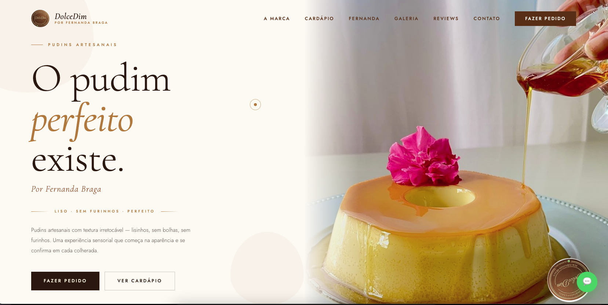
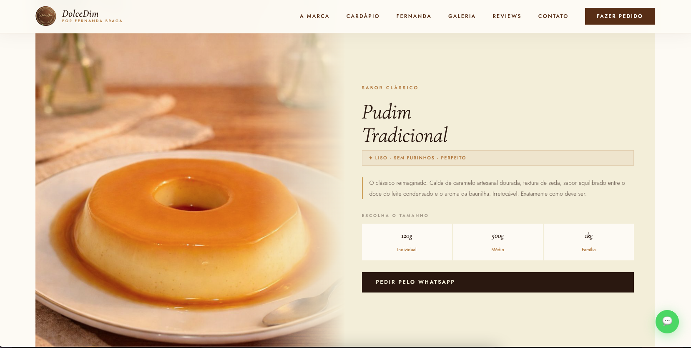
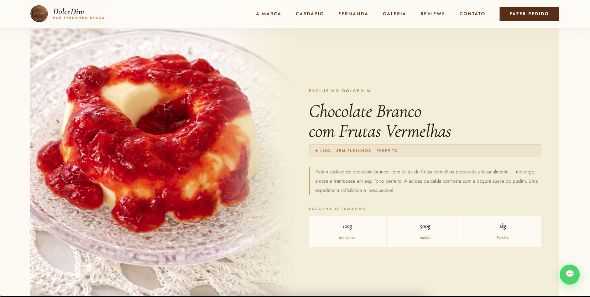
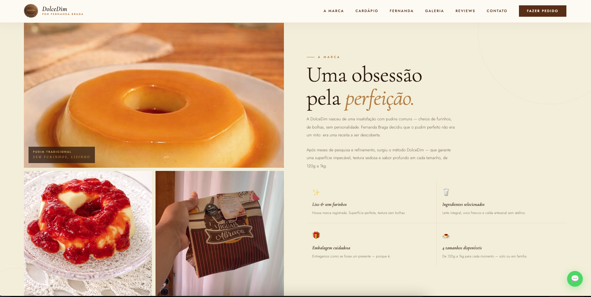
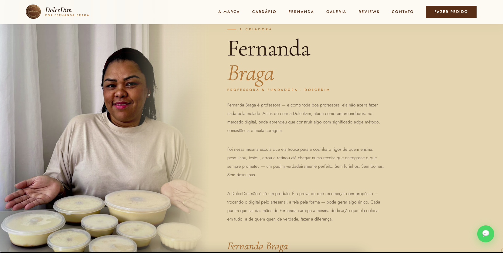
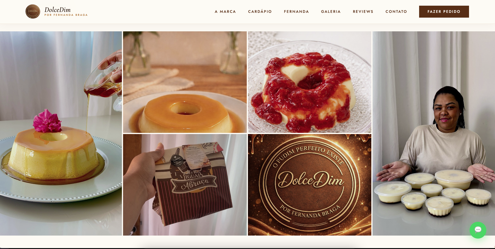
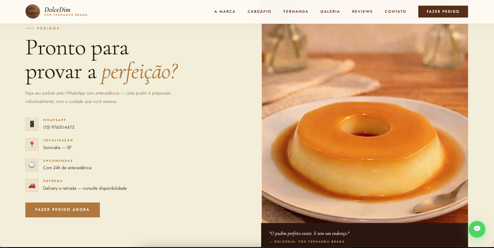
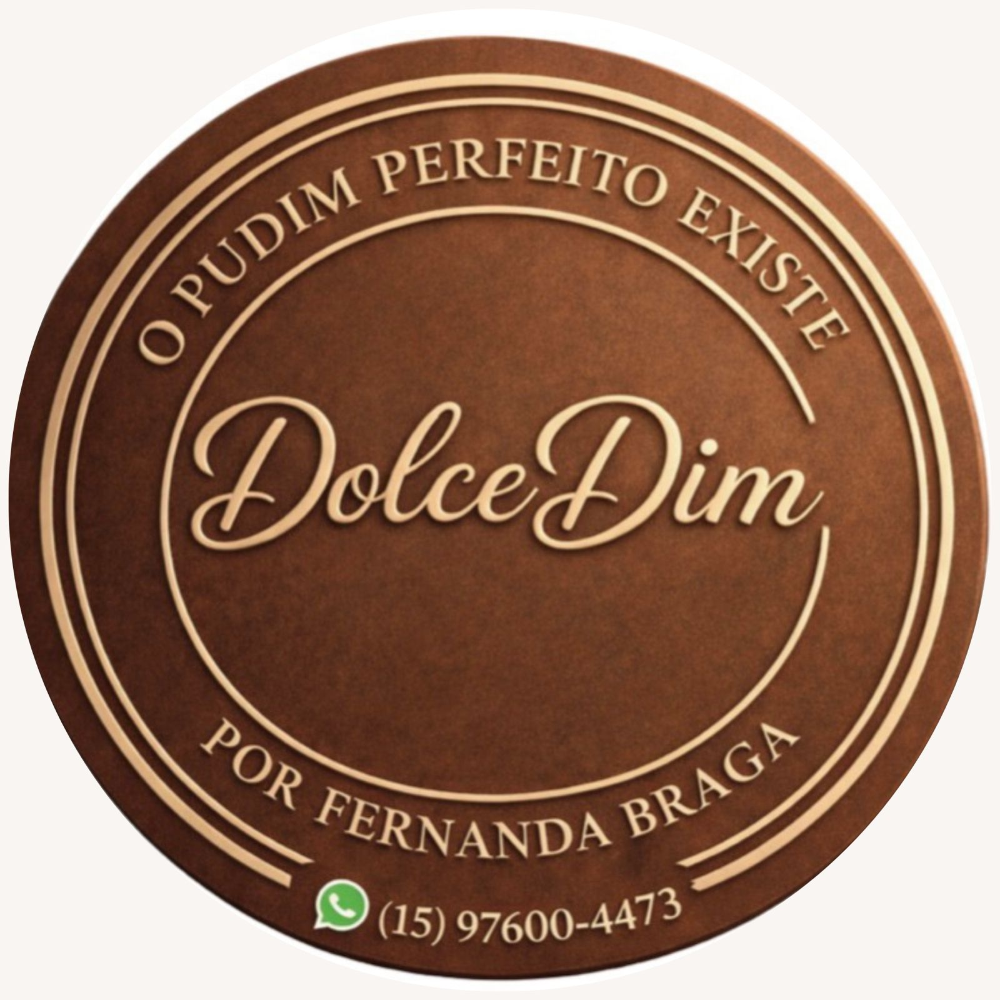

# 🍮 DolceDim — Site Institucional

> **"O pudim perfeito existe."** — Site oficial da marca DolceDim, por Fernanda Braga.



---

## 📋 Sobre o Projeto

Site institucional desenvolvido para a **DolceDim**, marca artesanal de pudins premium de Sorocaba — SP, fundada por Fernanda Braga. A marca é conhecida pelos pudins lisinhos, sem furinhos e com textura impecável.

O site foi desenvolvido com foco em elegância, refinamento e conversão — transmitindo a identidade visual terrosa e sofisticada da marca.

---

## ✨ Funcionalidades

- **Hero section** com imagem de impacto e selo rotativo animado
- **Faixa de texto animada** com slogan da marca
- **Seção "Sobre a Marca"** com galeria de fotos e diferenciais
- **Cardápio completo** com sistema de abas por sabor:
  - Pudim Tradicional
  - Chocolate Branco com Frutas Vermelhas
  - Doce de Leite *(em breve)*
  - Geladinhos Sabor Pudim *(em breve)*
  - Chocolate Belga *(em breve)*
- **Tabela de tamanhos** por sabor (120g · 500g · 1kg)
- **Seção Fernanda Braga** com história da fundadora
- **Galeria mosaico** com fotos reais dos produtos
- **Depoimentos** de clientes
- **Contato** com link direto para WhatsApp
- **Cursor customizado** com animação suave
- **Botão WhatsApp flutuante** com pulsação
- **Animações de reveal** ao rolar a página
- **Lightbox** na galeria ao clicar nas fotos
- **Efeito parallax** no hero
- **Totalmente responsivo** — mobile, tablet e desktop

---

## 🛠️ Tecnologias

| Tecnologia | Uso |
|------------|-----|
| HTML5 semântico | Estrutura e acessibilidade |
| CSS3 | Estilização, animações, grid layout |
| JavaScript (ES6+) | Interações, Intersection Observer, abas |
| Google Fonts | Cormorant Garamond + Jost |

> Projeto **100% vanilla** — sem frameworks, sem dependências externas, sem npm.

---

## 📁 Estrutura de Arquivos

```
dolcedim-site/
│
├── index.html          # Estrutura HTML completa
├── style.css           # Estilos organizados por seção
├── script.js           # Interações e animações
│
└── images/
    ├── pudim-tradicional.jpeg
    ├── pudim-chocolate-branco.jpeg
    ├── pudim-calda.jpeg
    ├── fernanda-braga.jpeg
    ├── embalagem.jpeg
    ├── logo-gold.jpeg
    └── logo-selo.jpeg
```

---

## 🎨 Identidade Visual

| Elemento | Valor |
|----------|-------|
| Cor principal | `#2C1810` — Cacau profundo |
| Cor de destaque | `#B8773A` — Caramelo dourado |
| Cor de fundo | `#FDFAF4` — Branco quente |
| Cor creme | `#F5EDD8` — Creme suave |
| Fonte títulos | Cormorant Garamond (serif italiana) |
| Fonte textos | Jost (sans-serif moderna) |

---

## 📸 Screenshots

| Seção | Preview |
|-------|---------|
| Hero |  |
| Cardápio |  |
| Cardápio02 |  |
| Sobre & Diferenciais |  |
| Fernanda Braga |  |
| Galeria |  |
| Final |  |

---

## 🚀 Como Usar

Não precisa de instalação. É só abrir direto no navegador:

```bash
# Clone o repositório
git clone https://github.com/BragaDudu/dolcedim-site.git

# Abra o arquivo
cd dolcedim-site
open index.html   # macOS
start index.html  # Windows
```

Ou simplesmente **arraste o `index.html`** para o navegador.

---

## 📱 Responsividade

O layout foi testado e otimizado para:

- **Desktop** — 1280px+ (layout full com grid de 2 colunas)
- **Tablet** — 780px–1100px (ajuste de paddings e grids)
- **Mobile** — até 780px (layout em coluna única, nav colapsado)

---

## 💼 Sobre o Desenvolvimento

Site desenvolvido como projeto freelance para a marca **DolceDim**.

A proposta foi criar uma experiência visual que transmitisse o mesmo cuidado
e sofisticação presentes nos produtos — elegância terrosa, tipografia refinada
e animações sutis que não distraem, mas encantam.

---

## 📞 Contato da Marca

| Canal | Info |
|-------|------|
| WhatsApp | [(15) 97600-4473](https://wa.me/5515976004473) |
| Instagram | [@dolcedim](https://instagram.com/dolcedim) |
| Localização | Sorocaba — SP |

---

## 👨‍💻 Desenvolvedor

Feito com ☕ por **[Seu Nome]**

[](https://instagram.com/euoeduardobraga)
[](https://github.com/BragaDudu)
[](https://www.linkedin.com/in/eduardo-braga-a6a62b244/)

---

<p align="center">
  <br>
  <em>"O pudim perfeito existe."</em><br>
  <small>© 2024 DolceDim · Por Fernanda Braga</small>
</p>
